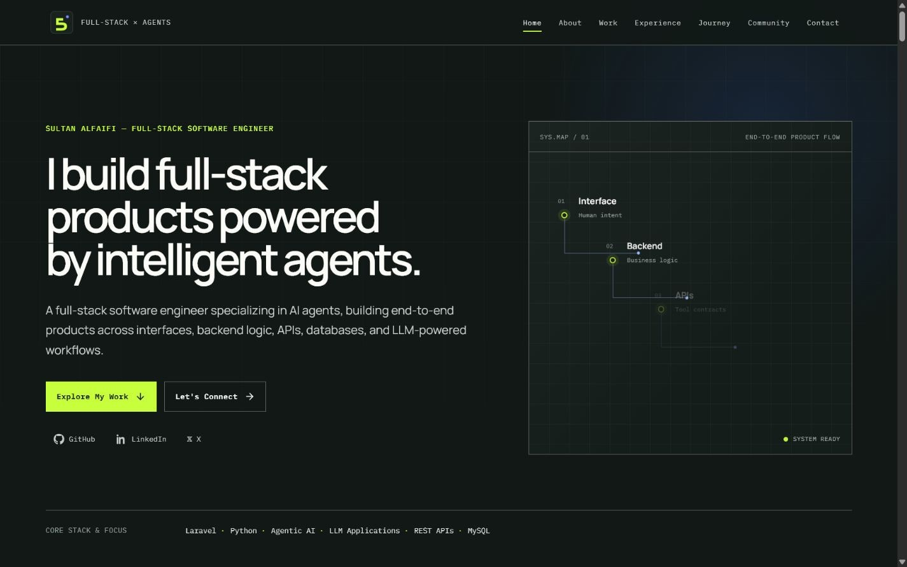

<div align="center">
  

  <h1>Sultan Alfaifi — Portfolio</h1>

  <p>
    A production-grade portfolio for a full-stack software engineer specializing
    in AI agents, intelligent systems, and end-to-end digital products.
  </p>

  <p>
    <a href="https://SultAlfaifi.com"><strong>Visit the live portfolio</strong></a>
    ·
    <a href="#local-development">Run locally</a>
    ·
    <a href="#content-and-asset-management">Update content</a>
  </p>

  <p>
    
    
    
    
    
  </p>
</div>



## Overview

This repository contains the source for
[SultAlfaifi.com](https://SultAlfaifi.com), the professional portfolio of
Sultan Alfaifi. It positions Sultan as a **Full-Stack Software Engineer
specializing in AI Agents** and presents his work through an editorial
system-architecture visual language.

The site is intentionally data-driven. Projects, experience, achievements,
programs, recommendations, organizations, social links, and asset presentation
rules are managed from one typed configuration file.

## Highlights

- System-architecture hero connecting interfaces, backend logic, APIs, data,
  and AI agents.
- Responsive editorial layout with independent, full-width sections.
- Typed organization rail with explicit relationship labels and accessible
  marquee behavior.
- Real portrait and supplied official brand assets—no stock photography or
  generated replacements.
- Non-destructive asset pipeline for trimming empty logo canvas, preserving
  aspect ratios, and generating optimized color and monochrome derivatives.
- Per-asset optical controls including scale, position, safe padding,
  background, trim mode, and monochrome behavior.
- Reduced-motion fallback, keyboard navigation, visible focus states, and
  screen-reader-safe duplicated marquee content.
- Programmatic WCAG contrast audit and automated semantic accessibility audit.
- Static export and automated GitHub Pages deployment.

## Design system

The interface combines editorial pacing with the visual language of software
systems:

| Token | Value | Purpose |
| --- | --- | --- |
| Ink | `#111816` | Primary technical surfaces |
| Paper | `#F4F3EC` | Editorial reading surfaces |
| Protocol blue | `#2F55B7` | Links, labels, and information signals |
| Chartreuse | `#C8FF3D` | Active states and high-contrast accents |
| Manrope | Display and body | Clear editorial typography |
| IBM Plex Mono | Utility and metadata | Technical labels and system notation |

All approved foreground/background combinations are documented in
[`contrast-audit.md`](./contrast-audit.md).

## Technical architecture

```text
Typed portfolio content
        │
        ├── Projects / experience / programs / achievements
        ├── Recommendations / community / organizations
        └── Asset presentation and provenance metadata
        │
        ▼
Next.js App Router + React components
        │
        ├── Responsive CSS design system
        ├── Optimized derived WebP assets
        ├── Accessibility and contrast safeguards
        └── Static metadata, sitemap, robots, and manifest
        │
        ▼
Static export → GitHub Actions → GitHub Pages → SultAlfaifi.com
```

## Technology

- Next.js 16 with the App Router
- React 19
- TypeScript with strict type checking
- Tailwind CSS 4
- Lucide icons
- Sharp for deterministic asset processing
- Axe Core for automated semantic accessibility checks
- Node.js native test runner
- GitHub Actions and GitHub Pages

## Project structure

```text
.
├── .github/workflows/       GitHub Pages deployment
├── app/                     Routes, metadata, and global design system
├── components/              Portfolio sections and reusable UI
├── data/portfolio.ts        Typed content and asset configuration
├── docs/                    Repository preview media
├── public/assets/           Generated web-ready asset derivatives
├── public/brand/            Sultan Alfaifi identity assets
├── scripts/                 Asset, contrast, accessibility, and link audits
└── tests/                   Content, accessibility, and responsive safeguards
```

## Local development

### Requirements

- Node.js 22 or newer
- npm 10 or newer

### Install and run

```powershell
npm install
npm run dev
```

Open [http://localhost:3000](http://localhost:3000).

### Production export preview

```powershell
npm run build
npm run start
```

The production command serves the static export from `out/`.

## Content and asset management

The main editorial source is
[`data/portfolio.ts`](./data/portfolio.ts). Update this file to manage:

- Identity, positioning, navigation, and social links
- Projects and evidence-conscious outcomes
- Experience, skills, achievements, and programs
- Community work and recommendations
- Organization names, relationships, URLs, and visibility
- Logo and portrait presentation overrides

Every asset record can control:

```ts
{
  visualScale,
  objectPosition,
  trim,
  safePadding,
  background,
  logoVariant,
  monochromeEnabled
}
```

Original supplied files remain unchanged outside the repository. To regenerate
approved web derivatives:

```powershell
npm run process:assets
```

## Quality assurance

Run the complete local validation suite:

```powershell
npm run check
```

This includes:

1. ESLint
2. Strict TypeScript validation
3. Automated repository tests
4. Programmatic WCAG color-contrast verification
5. Production static export

With the local preview running:

```powershell
npm run audit:a11y
npm run audit:links
```

The generated accessibility report is available in
[`accessibility-audit.md`](./accessibility-audit.md).

## Accessibility

- WCAG AA contrast targets for text and interactive states
- Protocol blue on paper: `6.08:1`
- Separate high-contrast focus colors for light and dark surfaces
- Links distinguishable by structure, icons, or underline—not color alone
- Keyboard-operable mobile navigation with focus restoration
- Accessible organization names and hidden duplicate marquee items
- Static wrapping organization grid for `prefers-reduced-motion`
- Intentional portrait cropping with preserved faces and aspect ratio

## Deployment

Pushes to `main` trigger
[`deploy-pages.yml`](./.github/workflows/deploy-pages.yml), which:

1. Installs locked dependencies with `npm ci`.
2. Runs the full validation suite.
3. Creates a static Next.js export in `out/`.
4. Uploads the artifact to GitHub Pages.
5. Publishes it to the configured custom domain.

The canonical production URL is:

**[https://SultAlfaifi.com](https://SultAlfaifi.com)**

## Author

**Sultan Alfaifi**  
Full-Stack Software Engineer specializing in AI Agents

- [GitHub](https://github.com/SultanAlfaifi)
- [LinkedIn](https://www.linkedin.com/in/alfaifi-sultan/)
- [X](https://x.com/SultAlfaifi/)
- [Portfolio](https://SultAlfaifi.com)

## Copyright

Copyright © 2026 Sultan Alfaifi. All rights reserved.

This repository is publicly viewable as the source of the portfolio. No
open-source license is granted unless a separate license file is added.
